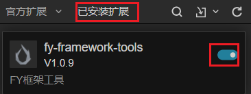
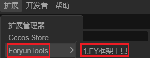
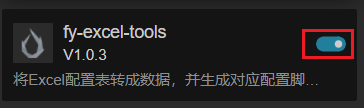
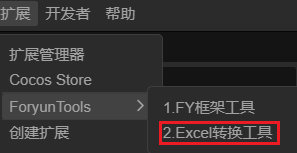

# 作者信息

- 个人简介
  - 懒癌晚期的独立游戏开发者
- 博客
  - [关于页面 - Foryun](https://www.foryun.com.cn/s/about)
- B站
  - [Foryun-浮云的个人空间_哔哩哔哩_bilibili](https://space.bilibili.com/2920221)
- Gitee
  - [Foryun (foryun) - Gitee.com](https://gitee.com/foryun)
- Github
  - [Foryun1009 (Foryun) (github.com)](https://github.com/Foryun1009)
- QQ交流群
  - 243390021

# 导航

- [框架简介](./extensions/框架简介.md)
- [编码规范](./extensions/编码规范.md)
- [编辑器工具](./extensions/编辑器工具.md)
- [自定义组件](./extensions/自定义组件.md)
- [资源命名规范](./extensions/资源命名规范.md)
- [Prefab结构解析](./extensions/Prefab结构解析.md)

# 启动说明

- 将`FYCGameFramework`工程的`extensions`文件夹下的所有文件拷贝到，CocosCreator项目的assets同级目录下的`extensions`文件夹下。
- 如果没有`extensions`文件夹，则直接将`FYCGameFramework`工程的`extensions`文件夹拷贝到CocosCreator项目的assets同级目录下

## fy-framework-tools

- 打开用CocosCreator打开工程项目
- 点击菜单的扩展->扩展管理器，如下图
- 
- 点击已安装扩展，找到`fy-framework-tools`点击开关，如下图
- 
- 点击菜单的扩展，找到`ForyunTools`->`1.FY框架工具`
- 
- 工具打开完毕，可以开始使用工具，具体使用方法，请参考[fy-framework-tools说明](./extensions/fy-framework-tools/README.md)

## fy-excel-tools

- 打开用CocosCreator打开工程项目
- 点击菜单的扩展->扩展管理器，如下图
- 
- 点击已安装扩展，找到`fy-excel-tools`点击开关，如下图
- 
- 点击菜单的扩展，找到`ForyunTools`->`2.Excel转换工具`
- 
- 工具打开完毕，可以开始使用工具，具体使用方法，请参考[fy-excel-tools说明](./extensions/fy-excel-tools/README.md)

# 更新说明

- [fy-framework-tools版本更新日志](./extensions/fy-framework-tools/版本更新日志.md)
- [fy-excel-tools版本更新日志](./extensions/fy-excel-tools/版本更新日志.md)
